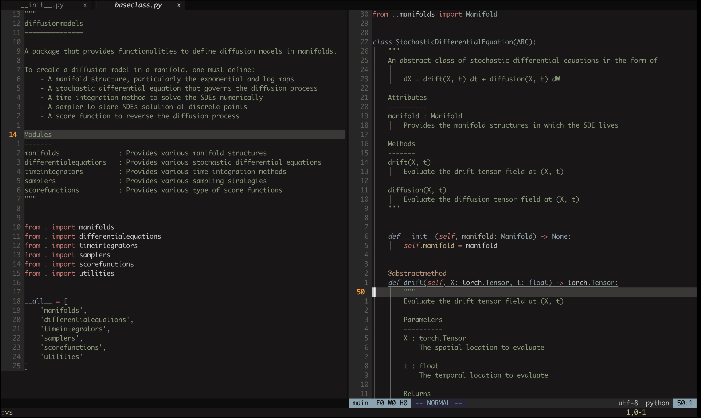

    <h1>Minimalist Neovim</h1>
    

        <a href="#dependencies">Dependencies</a>
        ∙
        <a href="#instructions">How to Use</a>
        ∙
        <a href="#looks">How It Looks</a>
    

    

        This is a fun attempt at creating a Neovim config.
        The project is heavily inspired by <a href="https://github.com/LunarVim">LunarVim</a> and the excellent step-by-step tutorial <a href="https://www.youtu.be/ctH-a-1eUME?si=mAsw4Qno6kmIIuQy">Neovim IDE from Scratch</a> by <a href="https://www.chrisatmachine.com">chris@machine</a>.
    

    

 

    

        The configuration uses as few plugins as possible to make it easier to maintain.
        That being said, it still has all essential development features:
    

    <h3>Language Servers</h3>
    

        The language server configs are set inside the <code>lsp</code> directory.
        You can create a new file inside the directory to add a new language server.
        See other files in the directory for examples.
        Subsequently, call <code>vim.lsp.enable()</code> to enable the language server.
        For examples, see the files inside the <code>after/ftplugin</code> directory.
    

    <h3>Code Completion and Snippets</h3>
    

        This config does not have / enable autocompletion.
        There isn't any good reason for this, I just prefer to use the ins-completion.
    

    <ul>
        <li>LSP completion is triggered using &lt;C-x&gt;&lt;C-o&gt;
        <li>Snippet is triggered using &lt;C-x&gt;&lt;C-u&gt;
    </ul>
    

        Only custom snippets are supported.
        To use snippets, you need to define them and then enable snippets support for the language.
        See files inside the <code>lua/snippets</code> directory for examples on how to define the snippets.
        See <code>tex.lua</code> in the <code>after/ftplugin</code> to see how to enable snippets for a given language.
    

    <h3>Debugging</h3>
    

        The DAP adapters and configs can be defined in the <code>after/ftplugin</code> files, for example, for Python.
        Some adapters and configs are quite complex to set, so they are separated into modules inside the <code>lua</code> directory.
    

    <h3>Plugin Manager (sort of)</h3>
    

        Calling it a plugin manager is a stretch but this config has a wrapper around git clone and git pull that will automatically download the plugins for you.
        Put the plugin specs inside the <code>lua/plugins</code> directory.
        To update your plugins, call
    

    <pre><code class="language-vim"><!--
    -->:lua require("plugin_manager").update()<!--
    --></code></pre>
    

        This just call git pull and execute the build command (if any) in all of your plugin directories.
        To uninstall a plugin, remove its spec file and then
        The directory is inside <code>site/pack/plugins/opt</code> in <code>vim.fn.stdpath("data")</code>.
    

    <h2>Dependencies</h2>
    

        The config requires <a href="https://neovim.io">neovim</a> v.0.11.x or newer.
        Install the language servers and debuggers yourself.
        This project <b>does not</b> require <a href="https://www.nerdfonts.com">Nerd Fonts</a> because it does not use any icon.
    

    <h2>How to Use</h2>
    

        During startup, nvim looks for a configuration file inside the nvim directory, which is typically <code>~/.config/nvim/</code>.
        To use the project, you can simply clone the repository using <a href="https://git-scm.com">Git</a>:
    

    <pre><code class="language-bash"><!--
    -->git clone https://github.com/rezhaTanuharja/minimalistNVIM.git ~/.config/nvim<!--
    --></code></pre>
    

        Subsequently, simply start Neovim and it will automatically clone and build the required plugins.
        Keep in mind that if you have not installed the required language servers or debug adapter protocol implementations, you may encounter errors.
    

