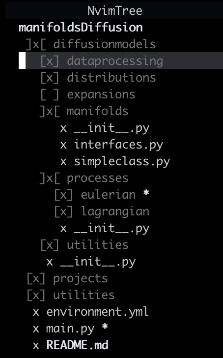
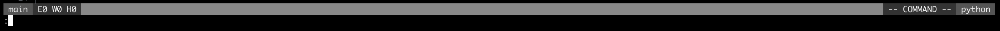
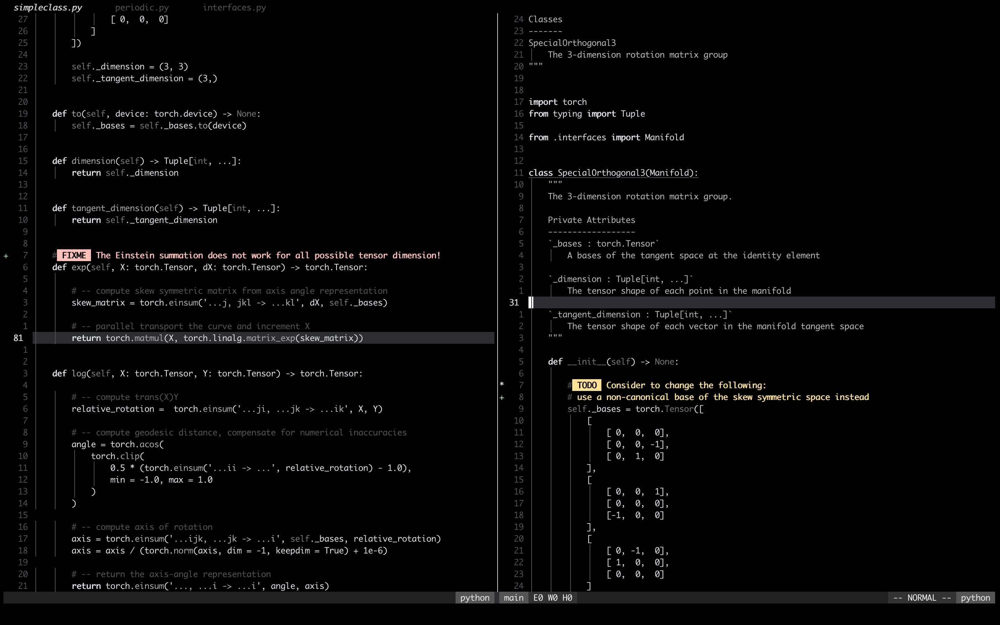

    <h1>
        Minimalist Neovim
    </h1>
    

        <a href="#dependencies">Dependencies</a>
        ∙
        <a href="#instructions">How to Use</a>
        ∙
        <a href="#looks">How It Looks</a>
    

    

        This project attempts to create an IDE-like experience for writing, editing, and debugging code with Neovim.
        The configuration structure is heavily inspired by <a href="https://github.com/LunarVim">LunarVim</a> and the excellent step-by-step tutorial <a href="https://www.youtu.be/ctH-a-1eUME?si=mAsw4Qno6kmIIuQy">Neovim IDE from Scratch</a> by <a href="https://www.chrisatmachine.com">chris@machine</a>.
        If you are interested in detailed explanations and guides, you should check him out.
    

    
     
     
    

    As the title of the project suggests, a minimalist configuration with as few plugins as possible is the main goal.
    This improves robustness against breaking changes from external plugins and makes the config easier to update and maintain.
    Although the config uses less than 20 plugins, it has all essential IDE features:
    

    <ul align="left">
        <li>Language servers and code diagnostics</li>
        <li>Code completion and custom snippets</li>
        <li>Debugging capability</li>
    </ul>
    

    That being said, if you are a Neovim user, I hope you see something interesting to adopt to your own config. If you are still considering Neovim, I hope you become a part of our community soon!
    

    <h2>
        Dependencies
    </h2>
    

        The config requires <a href="https://neovim.io">neovim</a> v.0.10.x or newer.
        In addition, users are expected to install the required language servers, e.g., <a href="https://microsoft.github.io/pyright/#/">Pyright</a>, and debug adapter protocol implementations, e.g., <a href="https://pypi.org/project/debugpy/">debugpy</a>, themselves.
        Unlike many Neovim configs, this project <b>does not</b> require <a href="https://www.nerdfonts.com">Nerd Fonts</a> because it does not use any icons.
    

    <h2>
        How to Use
    </h2>
    

        During startup, nvim looks for a configuration file inside the nvim directory, which is typically '~/.config/nvim/'.
        To use the project, you can simply clone the repository using <a href="https://git-scm.com">Git</a>:
    

    <pre><code class="language-bash"><!--
    -->git clone https://github.com/rezhaTanuharja/minimalistNVIM.git ~/.config/nvim<!--
    --></code></pre>
    

        Subsequently, simply start Neovim and <a href="https://github.com/folke/lazy.nvim.git">Lazy</a> will automatically install all of the plugins.
        Keep in mind that if you have not installed the required language servers or debug adapter protocol implementations, you may encounter errors.
    

    <h2>
        How It Looks
    </h2>
    

    The colors are mostly (not all!) grayscale.
    A typical Lua code with lua-language-server's hover capability looks like the following image.
    

    

        
    

     
    

    I do not use any icon other than what is available on a standard keyboard.
    This is because I do not really like to use icons and also because custom icons require more efforts to integrate into my colors selection.
    The plugin <a href="https://github.com/nvim-tree/nvim-tree.lua.git">nvim-tree</a> looks like this:
    

    

        
    

    

    The files are indicated with the letter x, directories are indicated with the square brackets where the orientations of and characters inside the brackets indicate if the directories are open, closed, empty, and so on.
    Modified files and directories are simply marked by asterisks.
    

    

    In some parts, I do some color play.
    For example, my <a href="https://github.com/nvim-lualine/lualine.nvim.git">lualine</a> looks like the following in normal and command mode, respectively:
    

    

        
        
    

    

    When I code, I stare at a (mostly) black screen.
    When I enter command mode, the midsection of the lualine change into a bright white color.
    This has a "flash" effect and my attention instinctively snaps to the bottom of the screen, where it needs to, because I am in the command mode.
    

    

    I still keep colors for important parts such as diagnostics, TODO, BUGS, etc..
    As an example, here is how a FIXME and a TODO from <a href="https://github.com/folke/todo-comments.nvim.git">todo-comments</a> look like:
    

    

        
    

    

    This is another benefit of using a (mostly) grayscale colors: important colors such as red (error) and yellor (warning) pops out and attract our attention immediately.
    

