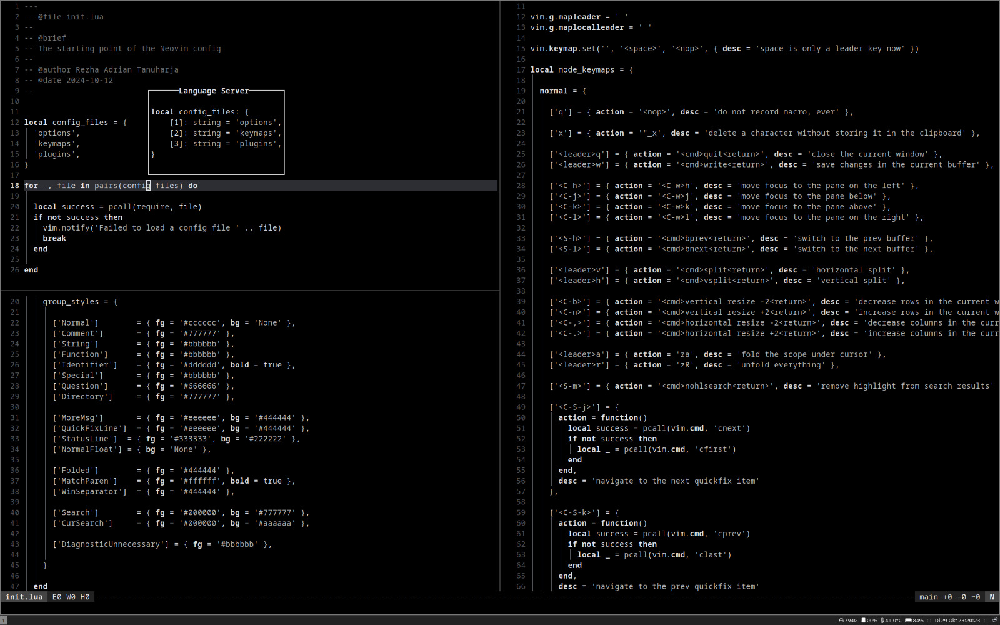

    <h1>
        Minimalist Neovim
    </h1>
    

        <a href="#dependencies">Dependencies</a>
        ∙
        <a href="#instructions">How to Use</a>
        ∙
        <a href="#looks">How It Looks</a>
    

    

        This project attempts to create an IDE-like experience for writing, editing, and debugging code with Neovim.
        The configuration structure is heavily inspired by <a href="https://github.com/LunarVim">LunarVim</a> and the excellent step-by-step tutorial <a href="https://www.youtu.be/ctH-a-1eUME?si=mAsw4Qno6kmIIuQy">Neovim IDE from Scratch</a> by <a href="https://www.chrisatmachine.com">chris@machine</a>.
        If you are interested in detailed explanations and guides, check him out.
    

    
     
     
    

    As the title of the project suggests, a minimalist configuration with as few plugins as possible is the main goal.
    This improves robustness against breaking changes from external plugins and makes the config easier to update and maintain.
    Although the config uses less than 20 plugins, it has all essential IDE features:
    

    <ul align="left">
        <li align="left">Language servers and code diagnostics</li>
        <li align="left">Code completion and custom snippets</li>
        <li align="left">Debugging capability</li>
    </ul>
    

    That being said, if you are a Neovim user, I hope you see something interesting to adopt to your own config. If you are still considering Neovim, I hope you become a part of our community soon!
    

    <h2>
        Dependencies
    </h2>
    

        The config requires <a href="https://neovim.io">neovim</a> v.0.10.x or newer.
        In addition, users are expected to install the required language servers, e.g., <a href="https://microsoft.github.io/pyright/#/">Pyright</a>, and debug adapter protocol implementations, e.g., <a href="https://pypi.org/project/debugpy/">debugpy</a>, themselves.
        Unlike many Neovim configs, this project <b>does not</b> require <a href="https://www.nerdfonts.com">Nerd Fonts</a> because it does not use any icon.
    

    <h2>
        How to Use
    </h2>
    

        During startup, nvim looks for a configuration file inside the nvim directory, which is typically '~/.config/nvim/'.
        To use the project, you can simply clone the repository using <a href="https://git-scm.com">Git</a>:
    

    <pre><code class="language-bash"><!--
    -->git clone https://github.com/rezhaTanuharja/minimalistNVIM.git ~/.config/nvim<!--
    --></code></pre>
    

        Subsequently, simply start Neovim and <a href="https://github.com/folke/lazy.nvim.git">Lazy</a> will automatically install all of the plugins.
        Keep in mind that if you have not installed the required language servers or debug adapter protocol implementations, you may encounter errors.
    

    <h2>
        How It Looks
    </h2>
    

    The colors are mostly (not all!) grayscale.
    A typical Lua code with lua-language-server's hover capability looks like the following image.
    An autocmd sets cursorline only in the focused window so it is easier to keep track of where the cursor is in a multi-window layout.
    

    

        
    

     
    

    The colors are deliberately chosen to look decent and non-distracting in both transparent and opague terminal windows.
    The previous image shows Neovim in iTerm2 on MacOS.
    The following image shows an identical layout in an opague Alacritty window on EndeavourOS:
    

    

        
    

     
    

    The following image shows how Neovim looks like with the <a href="https://github.com/nvim-tree/nvim-tree.lua.git">nvim-tree</a> window toggled open.
    It also shows how a diagnostic error is displayed inside the buffer and in the tree view.
    The TODO item is highlighted and the contextual location of the cursor is shown in the statusline thanks to <a href="https://github.com/nvim-treesitter/nvim-treesitter.git">nvim-treesitter</a>.
    

    

        
    

     
    

    The following image shows another essential IDE feature: a debugging capability, thanks to <a href="https://github.com/mfussenegger/nvim-dap.git">nvim-dap</a>.
    Slightly different from other configs, this project does not use nvim-dap-ui, nvim-dap-python, etc..
    Instead, we rely completely on what nvim-dap offers.
    

    

        
    

     
    

    By default, only the normal buffer window is shown, with red dash(es) indicating breakpoint location(s) and a blue arrow indicating the current position in program execution.
    All widgets such as the call stack (bottom left), the scopes (top right), and REPL (bottom right) only appear when the user toggles them.
    This is deliberate, since not all widgets are used all the time and will simply be a distraction if they are always present.
    

    <h2>
        Others
    </h2>
    

    While we do not think startup time matters, some people apparently do care.
    Last time we check, our startup time is ~7-15 ms, as shown below by <a href="https://github.com/folke/lazy.nvim.git">Lazy</a>'s profile.
    

    

        
    

